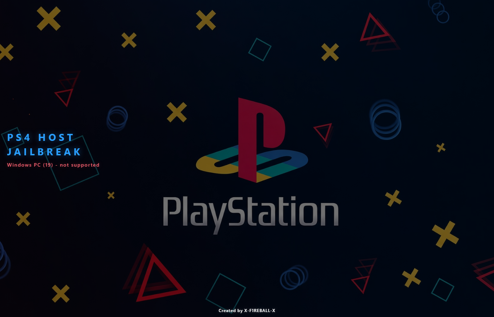

# PS4 Host Jailbreak

## Preview

Live page: https://x-f1reball-x.github.io/ps4hostjailbreak/

PS4 jailbreak / HEN host.

**Created by X-F1REBALL-X**

**Page:** https://x-f1reball-x.github.io/ps4hostjailbreak

## Firmwares

| Firmware | Chain | Status |
| --- | --- | --- |
| 13.02, 13.04, 13.50, 13.52 | Slopkit Relapse | Works |
| 12.50 - 13.00 | Slopkit Netctrl | Auto (untested here) |
| 11.03 - 12.02 | Slopkit Lapse | Auto (untested here) |
| 7.00 - 11.02 | CSSFontFace + Lapse | Auto (untested here) |
| 7.00 - 9.60 | PSFree + Lapse | `?chain=psfree` (untested) |
| 6.70 - 6.72 | BadHoist | Entry page (limited) |
| 6.00 - 6.69 | CSSFontFace + Lapse | Auto (untested here) |

Picks the chain by firmware. You can override with `?chain=` if needed.

## How to use

### Block Sony updates (DNS)

Public DNS that block Sony / PlayStation update hosts (probed Oct 2026). Pick one primary; leave secondary empty, or set secondary to another address from the same list.

| Role | DNS | Notes |
| --- | --- | --- |
| Primary | `62.210.38.117` | **Nomadic** — redirects PS4 update hosts to itself; normal browsing still works |
| Primary | `45.56.67.85` | Community / ArabPixel-related — sinkholes update hosts to `0.0.0.0`; normal browsing still works |
| Limited | `165.227.83.145` | Legacy **Al-Azif** — still answers for PlayStation domains, but refuses most general queries (not for normal internet) |
| Limited | `192.241.221.79` | Legacy **Al-Azif** — same as above |

Setup:

1. Settings > Network > Set Up Internet Connection.
2. Use **Custom** setup.
3. DNS Settings: **Manual**.
4. Primary DNS: one of the **Primary** addresses above (Nomadic or `45.56.67.85`).
5. Secondary DNS: leave empty, or use the other Primary address.
6. Save and test connection (fail to Sony is OK — that means updates are blocked).

Credits: **Nomadic** (`62.210.38.117`), community / ArabPixel-related (`45.56.67.85`), and **Al-Azif** for the classic DNS approach. Public DNS can go offline; if yours stops working, try the other Primary or self-host a blocker (Pi-hole / NanoDNS / Chūkei).

### Browser

1. Open the PS4 Internet Browser.
2. Clear Cookies and Clear Cache (Options menu).
3. Open: https://x-f1reball-x.github.io/ps4hostjailbreak
4. Add the page to **Favorites**.

### Jailbreak

1. Open the favorite / link.
2. Wait for cache (`Cache ready`), then the jailbreak starts.
3. Wait for success (the page tries to close).
4. If it fails: Jailbreak failed - restart your console.

## Credits

Thanks:

- **Sleirsgoevy** - BadHoist (6.70 - 6.72)
- **TheFloW** - NetControl / poops base (Netctrl)
- **Nathan Fargo** - CSSFontFace
- **abc** - PSFree
- **SpecterDev** / **ChendoChap** - Lapse
- **jordyidk** - Slopkit
- **raw13g** - Relapse / 13.xx offsets
- **B4411M** - offsets and patches
- **SiSTR0** - GoldHEN / HEN
- **zecoxao** - firmware dumps
- **Yenyen** - offsets / research
- **EchoStretch** - hosts / tools

## License

See `LICENSE`, `NOTICE`, and `third_party/licenses/`.
